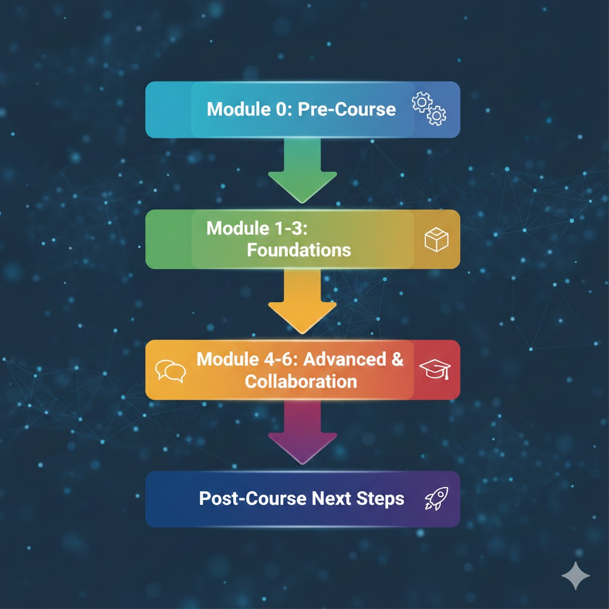

# 📘 Next Steps: Continuing Your AI Journey
---

# **🚀 Next Steps After Completing the AI Appreciation & Collaboration Mini-Course**

Completing this course is just the beginning of your AI journey. The following steps will help you deepen your understanding, practice responsibly, and stay connected with evolving AI technologies.

---

### **1. Reflect and Document**

- Review your capstone project and personal AI workflow.
- Journal insights: What worked? What surprised you? What would you do differently next time?
- Identify strengths and areas for growth in AI collaboration.
- Capture lessons learned to inform future projects.

---

### **2. Practice Regularly**

- Schedule short, consistent sessions to experiment with AI tools.
- Iterate prompts, refine projects, and test new approaches.
- Explore AI in different contexts—work, study, creative hobbies—to strengthen adaptability.

---

### **3. Expand Your Knowledge**

- Take foundational AI and ML courses: *Elements of AI*, Google ML Crash Course, or Coursera’s *AI for Everyone*.
- Read beginner-friendly books: *You Look Like a Thing and I Love You*, *Artificial Intelligence: A Guide for Thinking Humans*.
- Stay updated on AI trends, ethics debates, and real-world applications via newsletters, blogs, or research updates.

---

### **4. Engage with Communities**

- Join online forums, discussion groups, or local meetups focused on AI literacy and ethics.
- Participate in hackathons, workshops, and collaborative projects.
- Exchange prompts, experiments, and ideas with peers to accelerate learning.

---

### **5. Apply AI Responsibly**

- Uphold ethical principles: transparency, fairness, privacy, and human oversight.
- Critically evaluate AI outputs; do not assume correctness.
- Use AI to amplify your thinking and creativity, not replace it.

---

### **6. Teach, Share, and Mentor**

- Guide peers, students, or colleagues in AI basics.
- Share your projects, insights, and reflections through blogs, presentations, or discussion forums.
- Lead small workshops or study sessions to reinforce your learning and inspire others.

---

### **7. Explore Advanced Topics (Optional)**

- Experiment with generative AI: text, images, audio, and code.
- Investigate agentic AI and autonomous decision-making systems.
- Learn about AI governance, bias mitigation strategies, and policy frameworks.

---

### **💡 Lifelong Learning Tip**

Think of AI not as a static tool to master, but as a collaborative partner. Stay curious, experiment ethically, and revisit your personal AI practice regularly to grow alongside the technology.

---

# **📊 AI Appreciation & Collaboration — Next Steps Roadmap**

---

### **Key Actions by Stage**

**1. Pre-Course & Modules 1–3: Build Awareness**

- Reflect on AI concepts and real-world applications.
- Observe AI in daily life and take notes.
- Discuss examples with peers for shared understanding.

**2. Modules 4–6: Practice Collaboration**

- Experiment with prompts and AI tools.
- Develop mini-projects to practice iterative workflows.
- Refine a personal AI workflow for creative and professional use.

**3. Modules 7–8: Advanced Exploration**

- Explore generative AI for text, images, music, or code.
- Investigate agentic AI with autonomy features.
- Complete the capstone: define goals, collaborate with AI, and reflect on outcomes.

**4. Post-Course Lifelong Learning**

- **Reflect & Document:** Journal projects, experiments, and lessons learned.
- **Practice Regularly:** Keep experimenting with prompts and iterative projects.
- **Expand Knowledge:** Read books, take courses, follow research updates.
- **Engage Communities:** Participate in forums, workshops, and collaborations.
- **Teach & Share:** Mentor others, lead discussions, and showcase your projects.
- **Apply Responsibly:** Uphold ethics, fairness, privacy, and human oversight.